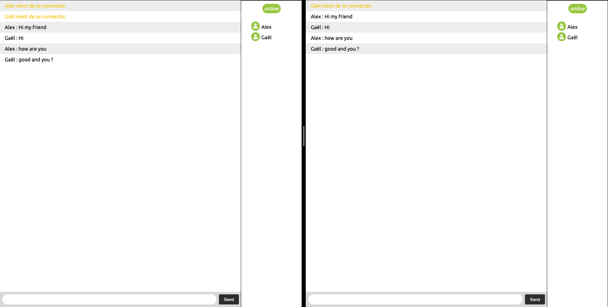

# The Instant-messaging-js project

## Introduction

The instant-messaging-js is a personal project based on socket io and node js, to discover instant messaging.

##  Example

A image example of the project, with some additional functionality.

For more information, see the [tutorial](https://socket.io/get-started/chat).

## Support

Please file issues here at Github.

Mail: alex-viard@hotmail.fr 

Created and maintained by [Alex Viard](https://github.com/AlexViard).
